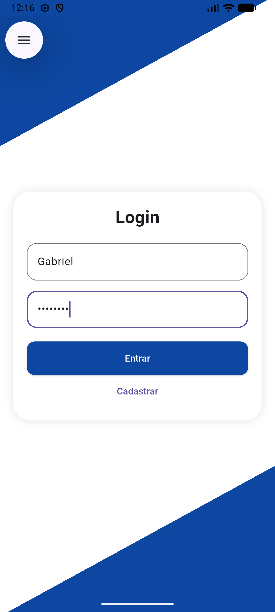
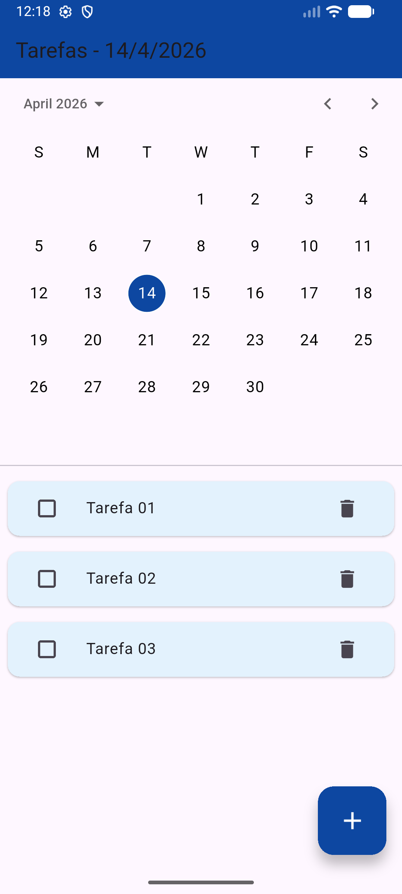
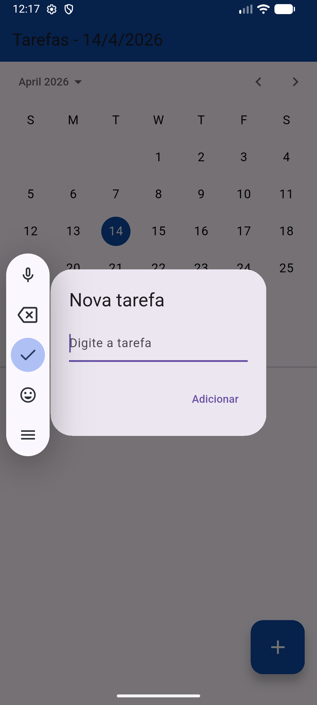

# App de Tarefas Flutter

## Preview

  
  
  
  
  

Aplicativo mobile desenvolvido em Flutter com autenticação básica e
gerenciamento de tarefas por data.

------------------------------------------------------------------------

## Funcionalidades

-   Tela de login
-   Tela de cadastro
-   Seleção de data via calendário
-   Criação de tarefas
-   Marcar tarefas como concluídas
-   Remoção de tarefas
-   Listagem filtrada por data
-   Ordenação automática:
    -   Tarefas pendentes primeiro
    -   Ordenação alfabética

------------------------------------------------------------------------

## Estrutura do Projeto

lib/ 
model/ -task.dart 

screens/ login_screen.dart - register_screen.dart - home_screen.dart 

 main.dart
 

------------------------------------------------------------------------

## Tecnologias Utilizadas

-   Flutter
-   Dart
-   Material Design

------------------------------------------------------------------------

## Lógica do Sistema

### Modelo de Tarefa

Cada tarefa contém: - Título - Data - Status (concluída ou não)

### Filtro por Data

As tarefas exibidas são filtradas com base na data selecionada no
calendário.

### Ordenação

-   Tarefas não concluídas aparecem primeiro
-   Ordenação alfabética entre tarefas do mesmo estado

------------------------------------------------------------------------

